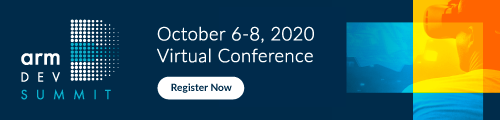

# Autoware Open Source Software for Autonomous Vehicles

# Hands-on workshop at Arm DevSummit October 2020
During this workshop, we will be running through some of the features of Autoware, the first all-in-one open source autonomous driving system. The exercises will be carried out using VMs running on Tier IV's Autoware Online system.

## Minimum System Requirements for the workshop
### Hardware
 - [A Windows/Mac/Linux computer that is capable of supporting Google Chrome](https://support.google.com/chrome/a/answer/7100626?hl=en)

### Software
 - Google Chrome (latest version)

### Recommendations
- Whilst some latency issues may occur, a high-speed Internet connection is strongly recommended to minimise the effect of such issues.

# Exercises
- [Exercise 0: Introduction (or how we're going to be doing things)](exercises/exercise0.md)
- [Exercise 1: Setting up your Autoware test environment](exercises/exercise1.md)
- [Exercise 2: RViz basics and replaying a rosbag](exercises/exercise2.md)
- [Exercise 3: NDT Scan Matching](exercises/exercise3.md)
- [Exercise 4: Simulation testing with dummy objects](exercises/exercise4.md)
