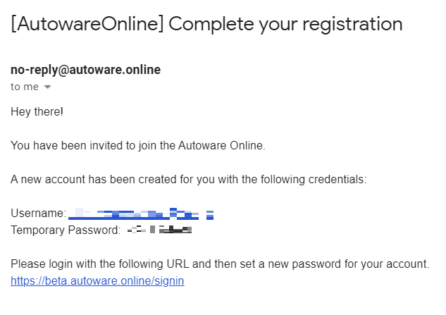
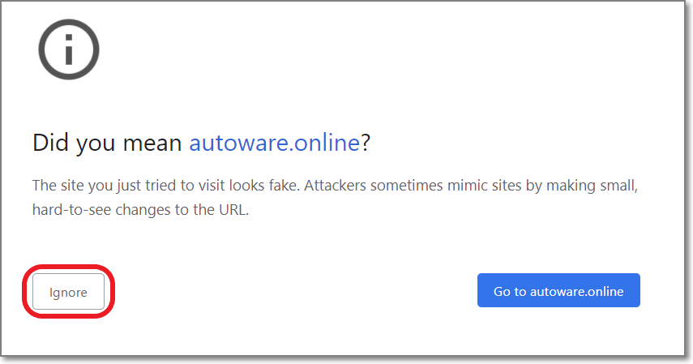
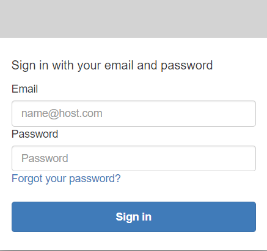
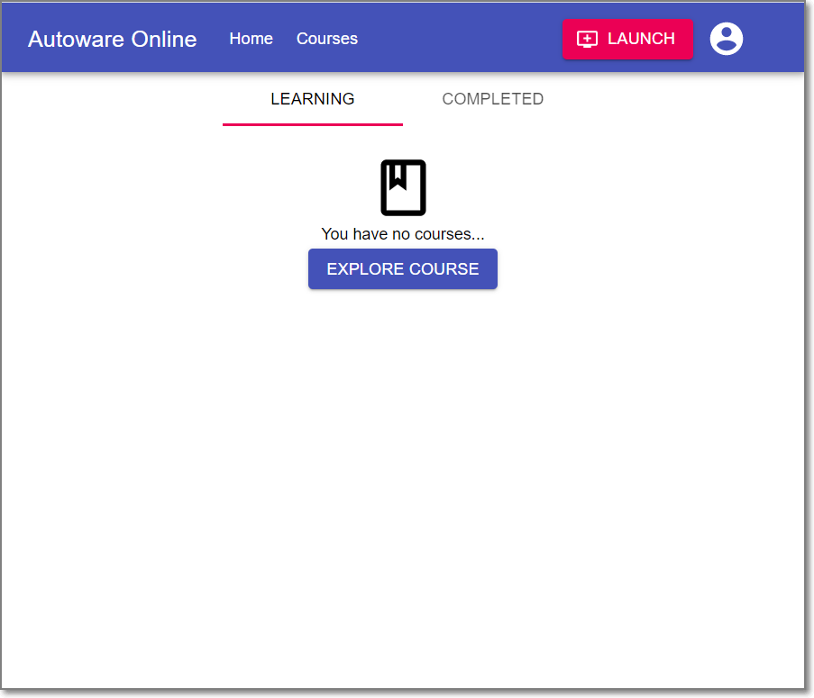
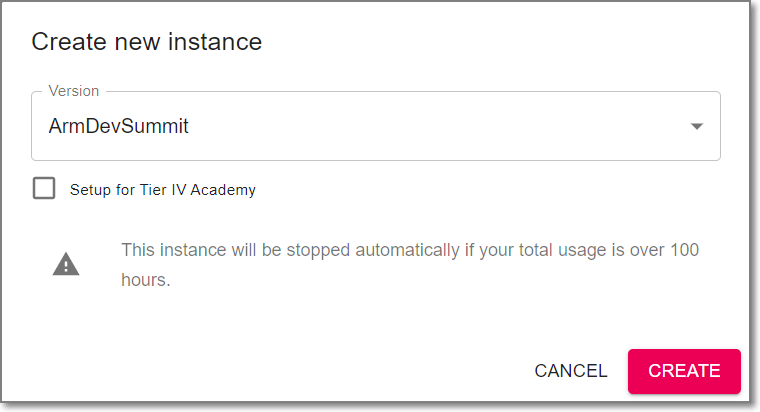
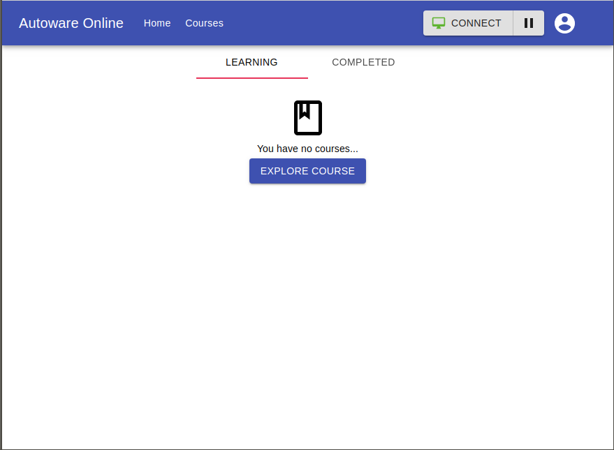
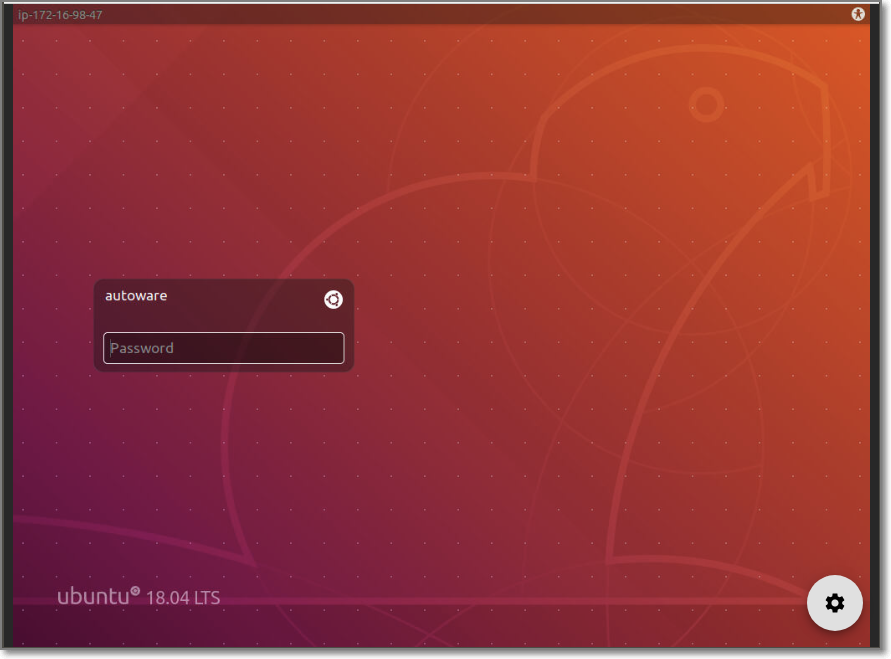
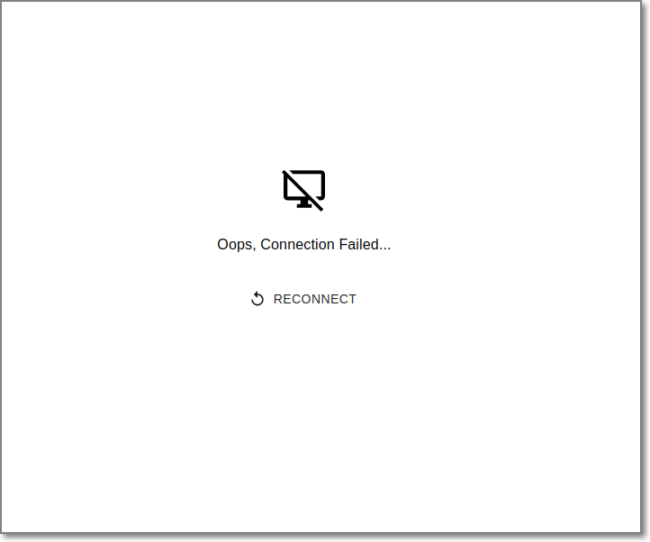
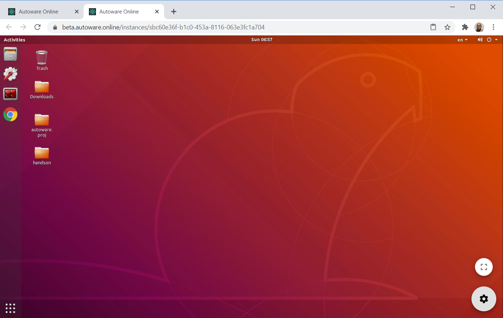

# Exercise 1: Setting up your Autoware test environment

1. For participants of the ARM DevSummit Autoware workshop, if all is well then you should have received an email from no-reply@autoware.online with the subject "[AutowareOnline] Complete your registration" similar to the one shown below.
   

2. Using the Chrome browser, navigate to https://beta.autoware.online/signin and click "Ignore" when the safety warning pops up.

3. When prompted, enter the username and password in the email. 

4. A new dialog will appear prompting you to change your password. The password must be 8 characters or more and contain at least one upper-case letter and one digit.

5. After you have changed your password, click the "Launch" button in the top-right hand corner of the next screen

6. Click "Create" on the "Create New Instance" dialog that pops up.

 

7. The "Launch" button will change to "LOADING" as the VM instance is being created - this process will take around a minute. 

1. Once the VM has been created, the "LOADING" button will change to say "Connect". Click this button.

9. A new tab will open and show the Ubuntu login prompt. Enter "autoware" as the login password

10. If the following screen is displayed instead of the expected Ubuntu login screen, click on “RECONNECT” in the middle of the screen to reconnect to the instance. If the "Connection Failed" screen keeps coming up, then please wait a few minutes before retrying.

11. After logging in, you will be presented with the Ubuntu desktop. If you've made it this far, then you're all set to begin!

| Next |
| ---- |
| [Exercise 2: RViz basics and replaying a rosbag](exercise2.md) |
