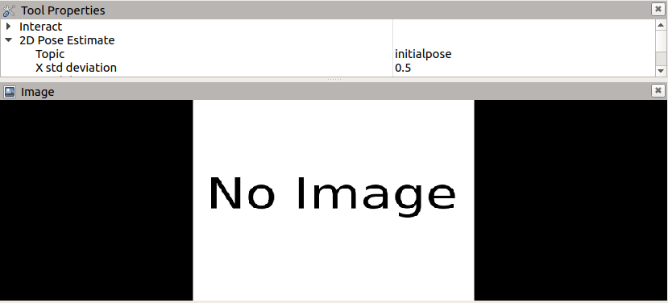
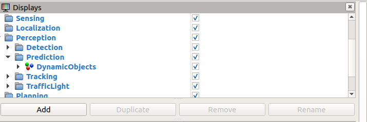
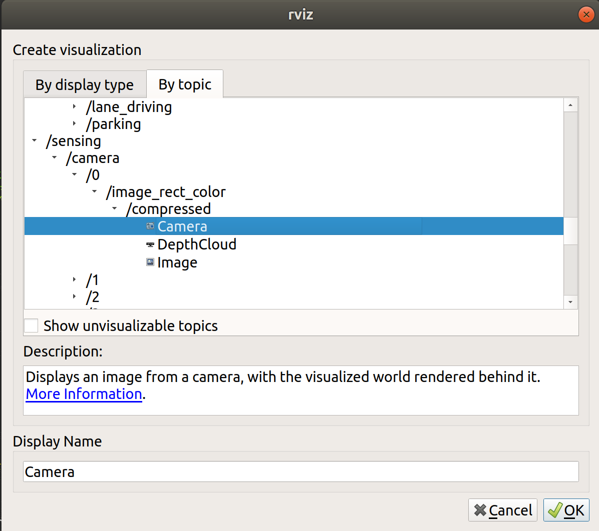
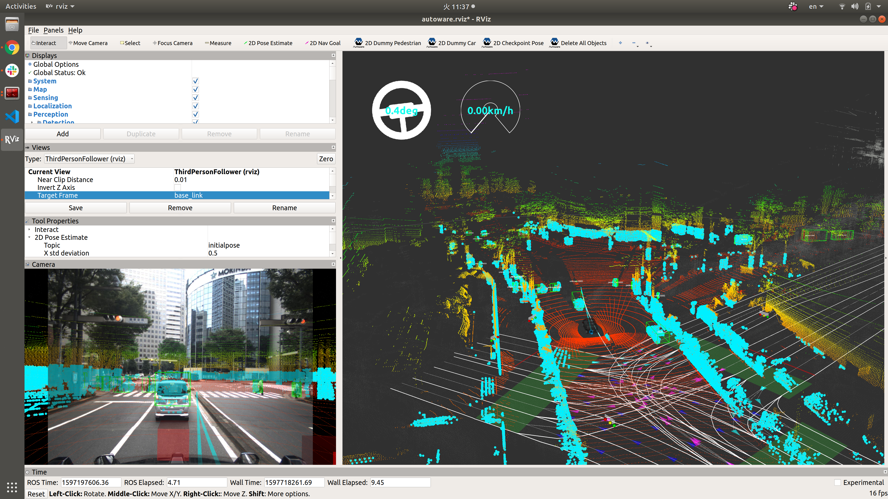

# Exercise 3: Object detection and sensor fusion

1. Open the autoware.launch file, which should be located in the following folder:
~/AutowareArchitectureProposal/src/launcher/autoware_launch/launch

2. Under the `<!-- Perception -->` section, edit the following line as follows:

From:
```xml
<arg name="mode" value="lidar"/>
```

To:
```xml
<arg name="mode" value="camera_lidar_fusion"/>
```

3. Open two terminals, and run the following commands in the first terminal:
```
cd ~/autoware.proj
source ./install/setup.bash
export VEHICLE_ID=1089
roslaunch autoware_launch logging_simulator.launch vehicle_model:=jpntaxi sensor_model:=aip_xx1 map_path:=/home/autoware/handson/ex3/maps
```

4. In the second terminal, run the following commands, then hit the space bar to pause rosbag playback:
```
cd ~/autoware.proj
source ./install/setup.bash
rosbag play /home/autoware/handson/ex3/fusion_sample.bag --clock -r 0.5 /tf:=/tf_null /tf_static:=/tf_static_null /perception/object_recognition/tracking/objects:=/perception/object_recognition/tracking/objects_null /perception/object_recognition/objects:=/perception/object_recognition/objects_null /perception/object_recognition/detection/objects:=/perception/object_recognition/detection/objects_null /sensing/camera/traffic_light/camera_info:=/sensing/camera/traffic_light/camera_info_null /localization/twist:=/localization/twist_null
```

5. In RViz, switch to ThirdPersonFollower view and adjust the view to your preference.

6. Close the Tool Properties and Image panels by clicking the X in the top-right corner of each panel


7. Add an Image panel that shows the recorded camera image data with perception data from the LiDAR sensor overlaid on top. 
- Click the Add button in the Displays panel of RViz
- In the dialog that appears, click the "By topic" tab, scroll down to "/sensing", then double-click on "/camera"



8. Return to the second terminal and hit the space bar again to resume playback, then return to RViz. Your RViz view should hopefully look similar to the image below


9. Now, we've just displayed data from a single camera, but the rosbag actually contains data from six (!) cameras, so let's see what those six cameras look like when shown all together.


| Next |
| ---- |
| [Exercise 4: Traffic Light Recognition](exercise4.md) |
