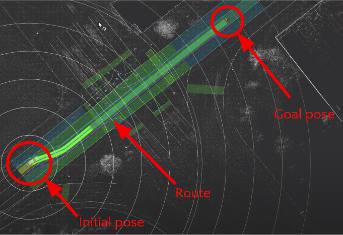
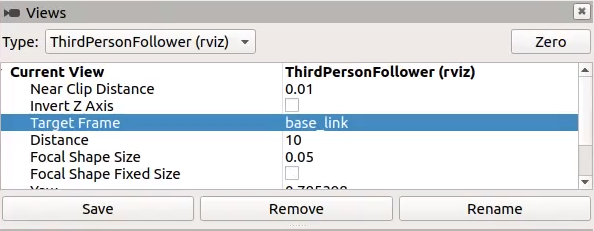
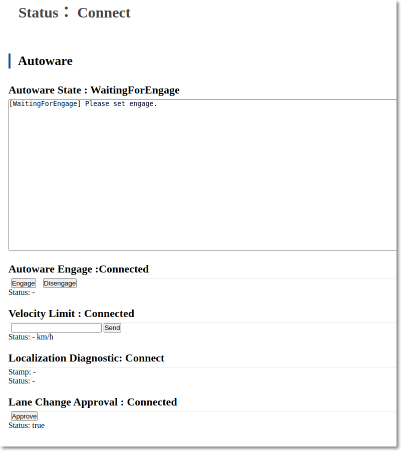
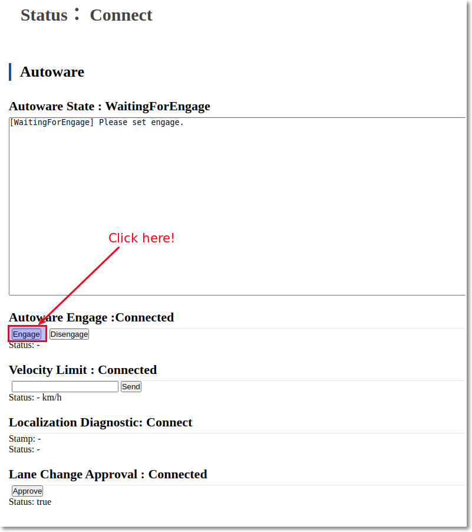
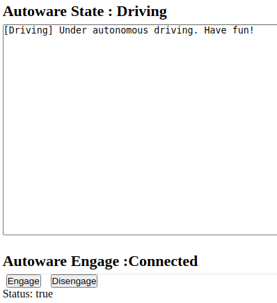

# Exercise 5: Simulation testing with dummy objects

For this exercise, we will be using the Planning Simulator which only requires a single terminal window.

## Run RViz and set initial and goal poses
1. Open a terminal window, navigate to the Autoware.IV install directory and run the following command:
   
```
source ./install/setup.bash
```

2. Run RViz with the following command:

```
roslaunch autoware_launch planning_simulator.launch map_path:=/home/[username]/Downloads/planning_simulator_sample_map
```
- By default, RViz will open with an ImageView panel in the bottom-left corner, but this can be closed since it will not be used during this exercise.


3. Set the initial pose of the ego-vehicle
- Click “2D Pose estimate” button in the toolbar, or hit the “P” key


- Click and hold the left-mouse button, and then drag to set the direction of the pose


4. Set the goal pose of the ego-vehicle
- Click the “2D Nav Goal” button in the toolbar, or hit the “G” key

- Click and hold the left-mouse button, and then drag to set the direction of the pose


5. Confirm initial pose, goal pose and route are displayed



---

## Adding and removing dummy obstacles, both moving and stationary
6. Add a dummy car
- Click the “2D Dummy Car” button in the toolbar, or hit the “K” key

- Click and hold the left-mouse button, and then drag to set the direction of the pose


7. Add a dummy pedestrian
- Click the “2D Dummy Pedestrian” button in the toolbar, or hit the “L” key

- Click and hold the left-mouse button, and then drag to set the direction of the pose


8. Make dummy pedestrians and dummy vehicles stationary, and add a stationary dummy vehicle
- In the [Tool Properties] panel in the lower-left, under [2D Dummy Car], set Velocity to 0
- Click the “2D Dummy Car” button
- Click and hold the left-mouse button, and then drag to set the direction of the pose
- In the [Tool Properties] panel in the lower-left, under [2D Dummy Pedestrian], set Velocity to 0


9. Remove all dummy objects
- Click “Delete All Objects” button in the toolbar, or hit the “D” key

- Click the display

---

## "Number One, Engage!"
10.  Adjust RViz viewpoint to ThirdPersonFollower to change from a top-down 2D view to a 3D view
- In the Views panel on the left side of the window, click the Type dropdown box and select "ThirdPersonFollower"
- Double-click the Target Frame value and select "base_link"
- Click the “Zero” button




11.  Use the Autoware Web UI to start the ego vehicle moving
- Open a browser and go to http://localhost:8085/autoware_web_controller


- Under “Velocity Limit : Connected”, set the maximum velocity and click the “Send” button
- Under “Autoware Engage: Connected”, click the “Engage” button


- In the Web UI, Autoware State will change from "WaitingForEngage" to "Engage" and the ego-vehicle should now start moving along the route to the goal pose
  



